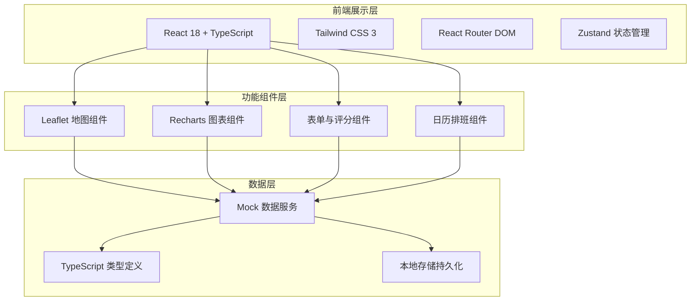
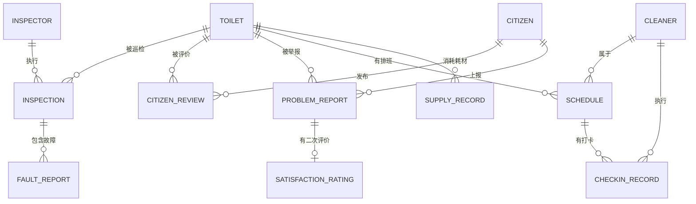

## 1. 架构设计



## 2. 技术描述
- **前端框架**：React@18 + TypeScript@5
- **构建工具**：Vite@5
- **样式方案**：Tailwind CSS@3
- **路由管理**：React Router DOM@6
- **状态管理**：Zustand@4
- **地图组件**：Leaflet@1.9 + react-leaflet@4
- **图表组件**：Recharts@2
- **图标库**：lucide-react@0.294
- **日期处理**：date-fns@3
- **后端服务**：无（纯前端项目，使用Mock数据）
- **数据持久化**：localStorage

## 3. 路由定义
| Route | 页面 | 说明 |
|-------|------|------|
| / | 公厕地图总览 | 首页，展示地图与公厕列表 |
| /toilet/:id | 公厕详情 | 单座公厕的完整信息展示 |
| /management | 公厕台账管理 | 公厕信息的录入与编辑 |
| /inspection | 巡检评分 | 巡检人员评分与故障报修 |
| /citizen | 市民评价与问题上报 | 市民评价与问题反馈 |
| /schedule | 保洁排班管理 | 排班表与打卡记录 |
| /supplies | 耗材管理 | 耗材记录与费用统计 |

## 4. 数据模型

### 4.1 实体关系图



### 4.2 数据类型定义

```typescript
// 公厕信息
interface Toilet {
  id: string;
  code: string;           // 厕所编号
  name: string;
  address: string;
  district: string;       // 所属区域
  lat: number;
  lng: number;
  openTime: string;       // 开放时间 如 "06:00-22:00"
  hasThirdBathroom: boolean;    // 第三卫生间
  hasBabyRoom: boolean;          // 母婴室
  hasAccessible: boolean;        // 无障碍设施
  seatCount: number;             // 厕位数
  managementUnit: string;        // 管理单位
  type: 'street' | 'park' | 'station' | 'mall';  // 公厕类型
  facilityLevel: 1 | 2 | 3 | 4 | 5;  // 设施完善程度
  averageInspectionScore: number;   // 平均巡检得分
  averageCitizenScore: number;      // 平均市民得分
}

// 巡检记录
interface Inspection {
  id: string;
  toiletId: string;
  inspectorId: string;
  inspectorName: string;
  date: string;
  groundCleanliness: 1 | 2 | 3 | 4 | 5;     // 地面洁净度
  toiletCleanliness: 1 | 2 | 3 | 4 | 5;     // 便器洁净度
  odorLevel: 1 | 2 | 3 | 4 | 5;             // 异味程度（1=异味重 5=无异味）
  suppliesAdequacy: 1 | 2 | 3 | 4 | 5;      // 耗材充足度
  facilityIntegrity: 1 | 2 | 3 | 4 | 5;     // 设施完好度
  totalScore: number;                        // 综合得分
  remark: string;
  faultReports: FaultReport[];
}

// 故障报修
interface FaultReport {
  id: string;
  inspectionId: string;
  toiletId: string;
  description: string;
  faultType: 'plumbing' | 'electrical' | 'hardware' | 'cleaning' | 'other';
  photoUrls: string[];
  status: 'pending' | 'processing' | 'resolved';
  reportedAt: string;
  resolvedAt?: string;
}

// 市民评价
interface CitizenReview {
  id: string;
  toiletId: string;
  citizenName: string;
  rating: 1 | 2 | 3 | 4 | 5;
  content: string;
  photoUrls: string[];
  createdAt: string;
}

// 问题上报
interface ProblemReport {
  id: string;
  toiletId: string;
  citizenName: string;
  problemType: 'dirty' | 'fault' | 'other';
  description: string;
  photoUrls: string[];
  status: 'pending' | 'processing' | 'resolved';
  reportedAt: string;
  assignedTo: string;
  resolvedAt?: string;
  resolutionNote?: string;
  processingHours?: number;     // 处理用时（小时）
  satisfaction?: SatisfactionRating;
}

// 满意度二次评价
interface SatisfactionRating {
  id: string;
  reportId: string;
  score: 1 | 2 | 3 | 4 | 5;
  comment: string;
  createdAt: string;
}

// 保洁排班
interface Schedule {
  id: string;
  toiletId: string;
  cleanerId: string;
  cleanerName: string;
  date: string;
  shiftType: 'morning' | 'afternoon' | 'night' | 'full';
  startTime: string;
  endTime: string;
}

// 打卡记录
interface CheckinRecord {
  id: string;
  scheduleId: string;
  toiletId: string;
  cleanerId: string;
  cleanerName: string;
  checkinTime: string;
  cleanupCompleteTime?: string;
  selfInspectionScore?: 1 | 2 | 3 | 4 | 5;
  note?: string;
}

// 耗材记录
interface SupplyRecord {
  id: string;
  toiletId: string;
  supplyType: 'toilet_paper' | 'hand_sanitizer' | 'soap' | 'trash_bag' | 'other';
  supplyName: string;
  quantity: number;       // 补给数量
  unit: string;           // 单位（卷、瓶、个等）
  unitPrice: number;      // 单价
  totalCost: number;      // 总价
  restockedAt: string;    // 补给日期
  nextEstimatedRestock?: string;  // 预估下次补给时间
}
```

## 5. 项目目录结构

```
src/
├── components/           # 公共组件
│   ├── layout/          # 布局组件（导航、侧边栏）
│   ├── toilet/          # 公厕相关组件
│   ├── map/             # 地图组件
│   ├── inspection/      # 巡检组件
│   ├── review/          # 评价组件
│   ├── schedule/        # 排班组件
│   ├── supplies/        # 耗材组件
│   └── ui/              # 通用UI组件（卡片、按钮、星级评分等）
├── pages/               # 页面组件
│   ├── MapOverview.tsx
│   ├── ToiletDetail.tsx
│   ├── ToiletManagement.tsx
│   ├── Inspection.tsx
│   ├── CitizenReview.tsx
│   ├── Schedule.tsx
│   └── Supplies.tsx
├── store/               # Zustand状态管理
│   ├── toiletStore.ts
│   ├── inspectionStore.ts
│   ├── reviewStore.ts
│   ├── scheduleStore.ts
│   └── suppliesStore.ts
├── data/                # Mock数据
│   ├── toilets.ts
│   ├── inspections.ts
│   ├── reviews.ts
│   ├── schedules.ts
│   └── supplies.ts
├── types/               # TypeScript类型定义
│   └── index.ts
├── utils/               # 工具函数
│   ├── date.ts
│   ├── score.ts
│   └── format.ts
├── App.tsx
├── main.tsx
└── index.css
```
