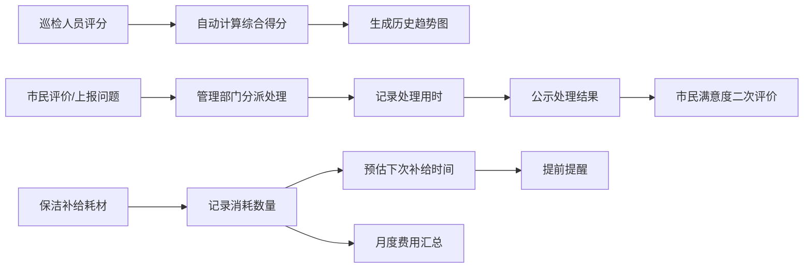

## 1. 产品概述

城市公共厕所分布与卫生巡检评分系统，旨在通过数字化手段实现城市公厕的精细化管理。系统整合了公厕地理信息展示、专业巡检评分、市民评价反馈、保洁排班管理及耗材消耗追踪五大核心模块，为城市环卫管理部门提供全流程的公厕管理解决方案。

- 解决问题：传统公厕管理手段落后、巡检记录不规范、市民诉求响应慢、耗材管理粗放
- 目标用户：城市环卫管理部门、巡检人员、保洁人员、广大市民
- 产品价值：提升公厕卫生水平、优化管理效率、增强市民满意度

## 2. 核心功能

### 2.1 用户角色
| 角色 | 核心权限 |
|------|----------|
| 管理员 | 公厕台账管理、巡检审核、排班管理、耗材管理、数据统计 |
| 巡检人员 | 公厕巡检评分、故障报修、查看任务 |
| 保洁人员 | 查看排班、记录到岗清扫、自检评分、耗材补给 |
| 市民用户 | 公厕查询、评分评价、问题上报、满意度二次评价 |

### 2.2 功能模块
1. **公厕地图总览页**：Leaflet地图展示、分色标记、区域筛选、条件筛选、公厕列表
2. **公厕详情页**：基本信息展示、巡检历史趋势图、市民评价列表、问题处理公示
3. **公厕台账管理页**：台账录入、信息编辑、列表查询
4. **巡检评分页**：多维度星级评分、综合得分计算、故障报修、历史趋势图
5. **市民评价与问题上报页**：星级评分、文字评价、问题上报、照片上传、满意度二次评价
6. **保洁排班管理页**：日/周视图排班、到岗记录、清扫记录、自检评分
7. **耗材管理页**：消耗记录、补给预估提醒、月度费用汇总统计

### 2.3 页面详情
| 页面名称 | 模块名称 | 功能描述 |
|-----------|-------------|---------------------|
| 公厕地图总览 | 地图视图 | Leaflet地图，按类型与设施完善程度分色标记，支持缩放拖拽 |
| 公厕地图总览 | 筛选面板 | 按区域、设施类型（第三卫生间/母婴室/无障碍设施）、评分等级筛选 |
| 公厕地图总览 | 公厕列表 | 侧边栏列表展示符合条件的公厕，支持快速定位 |
| 公厕详情 | 基本信息 | 展示公厕编号、位置、区域、开放时间、设施情况、厕位数、管理单位 |
| 公厕详情 | 巡检趋势 | 折线图展示历史综合得分趋势 |
| 公厕详情 | 市民评价 | 评价列表、评分统计、处理结果公示 |
| 公厕台账管理 | 录入表单 | 公厕信息录入与编辑 |
| 公厕台账管理 | 台账列表 | 查询、分页、编辑、删除操作 |
| 巡检评分 | 评分表单 | 地面/便器/异味/耗材/设施5个维度1-5星评分 |
| 巡检评分 | 故障报修 | 设施故障标记、描述、照片上传 |
| 巡检评分 | 历史记录 | 巡检历史列表、综合得分统计 |
| 市民评价 | 评价表单 | 星级评分、文字评价、照片上传 |
| 市民评价 | 问题上报 | 问题类型选择、描述、照片上传 |
| 市民评价 | 满意度评价 | 处理结果满意度二次评价 |
| 保洁排班 | 排班日历 | 日/周视图展示在岗人员与时间段 |
| 保洁排班 | 到岗打卡 | 记录到岗时间、清扫完成时间、自检评分 |
| 耗材管理 | 消耗记录 | 纸巾/洗手液等补给数量与日期记录 |
| 耗材管理 | 补给提醒 | 根据消耗速度预估下次补给时间并提前提醒 |
| 耗材管理 | 费用统计 | 月度耗材费用汇总、图表展示 |

## 3. 核心流程

### 巡检评分流程
巡检人员登录系统 → 选择待巡检公厕 → 逐项星级评分（5个维度）→ 自动计算综合得分 → 如有故障标记报修 → 提交巡检记录 → 生成趋势图表

### 市民评价与问题处理流程
市民查找公厕 → 提交评分与文字评价 / 上报问题（卫生脏乱/设施故障）→ 管理部门分派处理 → 处理完成并记录用时 → 公示处理结果 → 市民进行满意度二次评价

### 耗材管理流程
保洁人员补给耗材 → 记录补给数量与日期 → 系统根据消耗速度预估下次补给时间 → 提前提醒管理人员 → 月度费用自动汇总统计

## 4. 用户界面设计

### 4.1 设计风格
- **主色调**：深邃墨绿 (#0F4C3A) — 代表清洁、环保、公共服务
- **辅助色**：活力橙 (#F97316) — 用于强调、警告、CTA按钮
- **中性色**：米白背景 (#FAFAF7)、深灰文字 (#1C1C1C)、浅灰边框 (#E5E5E5)
- **状态色**：优秀绿 (#10B981)、良好青 (#14B8A6)、一般黄 (#F59E0B)、较差橙 (#F97316)、严重红 (#EF4444)
- **按钮风格**：圆润方形 (rounded-lg)，主色填充，hover时微提亮+轻微上浮阴影
- **字体**：标题使用"Noto Serif SC"（宋体衬线，稳重专业），正文使用"Noto Sans SC"（无衬线，清晰易读）
- **布局风格**：卡片式布局，顶部导航栏 + 侧边功能菜单 + 主内容区
- **图标风格**：使用lucide-react线性图标，简洁统一

### 4.2 页面设计概述
| 页面名称 | 模块名称 | UI元素 |
|-----------|-------------|-------------|
| 公厕地图总览 | 地图视图 | 全屏Leaflet地图、彩色标记点、弹窗详情、缩放控件 |
| 公厕地图总览 | 筛选面板 | 半透明侧边面板、下拉筛选、复选框、评分滑块 |
| 公厕详情 | 信息卡片 | 网格布局、图标标签、设施徽章、评分圆环 |
| 公厕详情 | 趋势图表 | 平滑折线图、渐变色填充、悬停数据点 |
| 巡检评分 | 评分组件 | 大尺寸星级按钮、进度条、实时综合得分显示 |
| 保洁排班 | 日历视图 | 时间轴、彩色班次块、打卡按钮组 |
| 耗材管理 | 统计卡片 | 数据可视化卡片、进度条、预警标识 |

### 4.3 响应式
- Desktop-first设计，主内容区最小宽度1024px
- 侧边栏在平板端可折叠，移动端变为底部Tab导航
- 地图区域始终自适应容器大小
- 表格在窄屏设备转为卡片列表展示

### 4.4 动效设计
- 页面加载：导航栏与侧边栏淡入滑入，内容区卡片错落浮现（staggered reveal）
- 地图标记：筛选变化时标记点淡出淡入过渡
- 星级评分：悬停星星发光，选中时有弹跳动效
- 按钮交互：hover时轻微上浮+阴影加深，click时微缩回弹
- 数据更新：数字变化时有滚动计数效果
